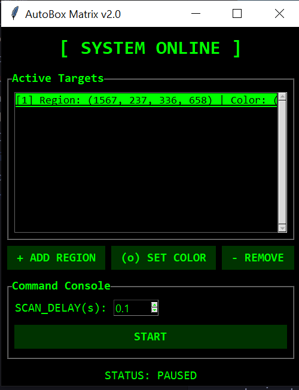

# AutoBox Color Clicker

**AutoBox Color Clicker** is a lightweight, "Matrix-themed" automation tool designed to watch specific areas of your screen and click when a target color appears.

## What is this for?
This tool is perfect for automating repetitive tasks that rely on visual cues. Instead of staring at the screen waiting for something to happen, you can set AutoBox to watch for you.

**Common Use Cases:**
*   **Reaction Games**: Instantly click targets the moment they appear.
*   **Video Players**: Automatically click "Skip Ad" or "Continue Watching" buttons when they pop up.
*   **System Monitoring**: Click to acknowledge alerts or status indicators in dashboard software.
*   **GUI Automation**: Automate workflows in legacy applications where buttons appear dynamically.
*   **Waiting Rooms**: Automatically click "Join" or "Refresh" buttons when they become active (change color).

## Features
*   **Multi-Target Support**: Watch multiple different regions for different colors simultaneously.
*   **Stealth Mode**: Run completely silently in the background using `AutoBox.pyw`.
*   **Matrix Theme**: Cool, high-contrast hacker aesthetic.
*   **Adjustable Delay**: Control how fast the bot scans to balance performance and reaction speed.
*   **Safe Pause**: Press **ESC** at any time to instantly pause the bot.

## Setup
1.  Ensure Python is installed.
2.  Run `run.bat` to start the application.
    - If it fails, you may need to install dependencies manually: `pip install -r requirements.txt`

## How to Use
1.  **Add Region**: Click **"+ ADD REGION"** and drag a box around the area you want to monitor.
2.  **Set Color**: Select the new item in the list, click **"(o) SET COLOR"**, and click the specific pixel you want to target.
3.  **Start**: Click **"START"** to begin monitoring.
4.  **Stop**: Click **"STOP"** or press **ESC** to pause.

## Troubleshooting
- **"System cannot find the path specified"**: This usually means Python is not in your system PATH.
    - When installing Python, make sure to check **"Add Python to PATH"**.
    - Or, you can edit `run.bat` to point to your specific python.exe location.
- **Not clicking?** Try increasing the tolerance in `bot.py` or re-picking the color to ensure it matches exactly.
- **Clicking wrong thing?** Your region might be too big or the color too common. Try a smaller, more specific region.
